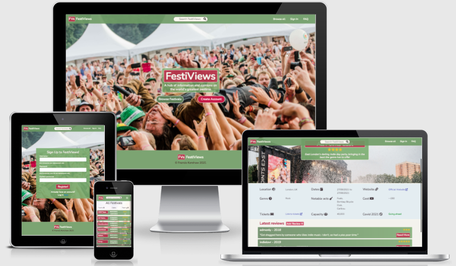
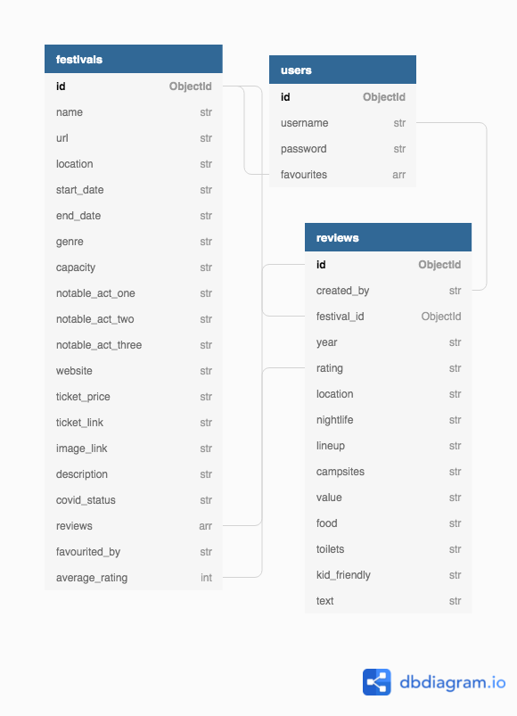

# FestiViews

## Code Institute's Milestone Project 3 - Backend Development

FestiViews is an information and reviews hub created for enthusiasts of the world's greatest pastime - music festivals. Users of the site can browse, search for, and 'favourite' the music festivals of their choice in order to learn key information, such as event dates and ticket cost, as well as discovering subjective opinions displayed by other users through the uploading of a festival review (or a 'festivew' if you will). As a frequent attendee of music festivals myself, I have always felt like festival goers have been missing a convenient and modern looking place to find all the relevant information and links for several events at once, and the closest versions of this vision that currently exist are in my opinion outdated and sometimes unpleasant to use. With that in mind, my aim with this project is to lay the basic groundwork for a site that will eventually end up being a vast improvement for user experience compared to what already exists.

This project is the third of four 'milestone' projects which are required to complete the Code Institute's diploma in full stack web development. Assessment criteria for this milestone project focuses on the ability to produce a full-stack site using HTML, CSS, JavaScript, Python, Flask and MongoDB that allows users to manage a common dataset about a particular domain. As such, part of this task involves implementing CRUD (create, read, update, and delete) capabilities to the users 

You can view the live website [here](https://festiviews.herokuapp.com/), and a link to the github repository can be found [here](https://github.com/franciskershaw/festiviews).

## Table of Contents
* [UX](#ux)
    * [User Stories](#user-stories)
* [Planning and Design](#planning-and-design)
    * [Strategy Plane](#strategy-plane)
    * [Scope Plane](#scope-plane)
    * [Structure Plane](#structure-plane)
    * [Skeleton Plane](#skeleton-plane)
    * [Surface Plane](#surface-plane)
        * [Colour Scheme](#colour-scheme)
        * [Typography](#typography)
    * [Data Model](#data-model)
* [Features](#features)
* [Existing Features](#existing-features)
* [Defensive design features](#defensive-design-features)
* [Features left to implement](#features-left-to-implement)
* [Technologies used](#technologies-used)
    * [Languages and frameworks](#languages-and-frameworks)
    * [Additional tools](#additional-tools)
* [Git commit messages](#git-commit-messages)
* [Testing](#testing)
* [Deployment](#deployment)
* [Cloning](#cloning)
* [Credits](#credits)
    * [Media](#media)
    * [Acknowledgements](#acknowledgements)  

  
## UX

My main goals for the creation of this website were as follows:
* To create a centralised hub of information through which the music festival community can inform themselves and leave reviews for others to consider.
* Have a website of this genre that is more aesthetically pleasing and more user friendly than the current available options.
* Demonstrate my new found backend development skills and ability to manipulate data so as to meet the pass criteria of the Code Institute for this milestone project.

### User Stories

#### Project Stakeholder/Site Developer

As the owner and developer of the site:

1. I want to produce a site where users can post, edit and browse festival reviews so that I can demonstrate my ability to implement C.R.U.D. functionality and pass this part of the course.
2. As the developer, I want the site to function exactly as intended so that only positive emotional responses are produced when interacting with the site.
3. As a bonus goal, I would like to grow the user base of the site so that the content can improve as more data is added by more and more users.

#### Users

1. As a user who wants to contribute to the site’s content, I want to be able to create a profile quickly and intuitively so that I can get started using the website.
2. As a returning user with a profile, I want to be able to sign in quickly so that I can resume my previous activities and have the option to sign out at the end of a session once I am finished.
3. As a user I want to be able to browse various festival pages so that I can find relevant information/links/reviews and help inform my decision on which festivals to attend.
4. As a user who is browsing the site, I would like to be able to sort the festivals by various relevant attributes such as alphabetical, or popularity.
5. As a user I want to search for a specific festival page (perhaps because I am already going to be attending) so that I can consume the same information as above.
6. As a user with a profile, I would like to ‘favourite’ certain festival pages so that I can view all of my favourite festivals in a convenient location.
7. As a user with a profile, I would like to be able to add reviews of the festivals I have been to before so that I can help potential future festival goers make their mind up about where to go.
8. As a user who has uploaded a festival review already, I would like to be able to edit that review so that I can add any retrospective comments or change certain of my scores if needs be.
9. As a user who has uploaded a review, I want to have the option to delete my review so that I can remove my presence on the site if I want to.
10. As a user who can’t find a particular festival on the site, I would like to have a means of requesting that the festival be added.
11. As a user who might not understand intuitively how to use the site, I would like some FAQs that might explain the site’s purpose and intended use so that I can learn how to use the site.

## Planning and Design

### Strategy Plane

As with my previous projects, the **user stories** as detailed above were the very first thing I attempted to solidify during strategy sessions in order to properly focus what my priorities should be during the creation of this project. Features that were not in service of the fulfilment of the user stories were not considered during development.

The **focus** of the project is:
* Provide a centralised hub of festival-specific information for festival attendees that site users can both consume and edit/contribute to themselves, thus creating a community-powered resource that increases in quality over time.

The **business goals** of the stakeholder are:
* To have users upload as many reviews as possible and increase engagement on the site.
* Encourage users to return as and when they need festival information.
* Have a site that is more user friendly than the other available options.

*Therefore, a bespoke website using both frontend and backend technologies is required to meet the focus and business goals as it is the only way to produce a hub that is both aesthetically pleasing and contains the data manipulation features necessary to allow users to contribute and edit content themselves.*

At this stage of planning during my previous projects I would usually scour the internet for inspiration from sites that fit a similar niche to what I was trying to achive in order to get a better understanding of what features and design choices would be familiar to my userbase. However, as I've stated already, I am of the belief that the current options are not all that user friendly and as such were used more as a guide to only what I interpreted as the most important and necessary featuers for my own site.

* [eFestivals](https://www.efestivals.co.uk/) - *this site is the current leader for collated festival information, and the objectively outdated visuals on their site as well as the cognitive overload found from several unnecessary features was actually the main reason I went down this route for my project in the first place.*
* [UK Festival Guides](https://www.ukfestivalguides.com/reviews/)
* [Travel Magazine Festival Reviews](https://www.thetravelmagazine.net/festivals/festival-reviews)

Using the below importance vs viability metric, I listed out all of the opportunities on offer when building this site to help me decide what was achievable, relevant and appropriate with regard to my user stories.

| Opportunity                | Importance | Viability
| -------------------------- | ---------- |-----------
| Create account or profile  | 5          | 5
| Browse and sort festival   | 3          | 4
| Search functionality       | 4          | 3
| Add, edit, delete reviews  | 5          | 3
| Display average score      | 2          | 3
| Upvote/downvote reviews    | 2          | 3
| Favourite a festival page  | 4          | 4
| Request missing fests      | 3          | 5
| Mail list sign up          | 2          | 4
| Personalised shopping list | 1          | 2
| FAQs                       | 3          | 5
| Blog                       | 1          | 2
| Forum                      | 2          | 1
| **Total**                  | **37**     | **44**

From this helpful bit of research, I concluded that overall the opportunities on offer were mostly viable when cosidered against their relative importance to the success of the project. However, it was clear at this stage that the following opportunities should not be pursued for this iteration of the project, as a result of the combination of their poor viablity when considered against their importance to my user stories:

* Implementation of a regular blog post.
* Customised shopping list for an upcoming festival.
* Active moderated user communication forum.

### Scope Plane

Based on research and planning achieved during the strategy plane, and considering any limitations of my current coding abilities, the features I decided were critical for the completion of my user stories were as follows:

#### Required functional specifications

* Sign up/login section.
* Festival specific pages, which I will be referring to as 'hubs'.
* Favourite certain hubs which can then be viewed on a separate personal page.
* Add, edit and delete reviews that are visible on a specific festival hub.
* Search function for all festivals available to browse on the site.
* A means of requesting that a new hub be added if it doesn't already exist.
* Admin (me) with the ability to add a new festival hub directly on the site.
* FAQ section.

#### Content requirements

* Sign up needs to be easy and feedback required if incorrect details entered.
* Festival hubs must contain all the information a user would be looking for regarding a festival.
* Feedback must be given when a hub has been favourited or a review has been uploaded/edited/deleted.
* Appropriate defensive measures in place when a user is editing or deleting content.
* Confirmation required when something is being deleted.
* Search bars must work properly and be useful as opposed to a hindrance to the user experience.
* Forms must be easy to use and contain all the required fields to get a request over properly. Invalid data must be dealt with appropriately.
* FAQs must be concise and relevant.

#### Nice to haves

I felt that the scope of this project was relatively ambitious, and as a result it was hard to know exactly how long I would need to implement all the key features. With that in mind, I decided to keep a list of things that I would like to implement if possible, but that were not absolutely necessary to the completion of the project:

* Average rating of each festival based from all user reviews.
* Advanced search function which can filter out certain results based on more detailed parameters.
* Extensive bio section of each music festival appearing on each festival hub.

### Structure Plane

Based on the functional specifications and content requirements outlined during the scope plane, I decided that the following pages would be required to disperse the necessary information and features that would allow users to reach the end of their journeys.

1. **Homepage, containing:**
* Hero image of a festival crowd, with the title and tagline appearing as an overlay.
* CTA button to browse all festivals. This is a feature which can be accessed by both users who have and have not signed up for a personal account. 
* CTA button to create an account, which will not be visible if the user is logged in already.

2. **Sign up and sign in pages, containing:**
* Login or registration form, depending on which one the user needs.
* Feedback if fields are incorrectly populated.
* Option to switch from register to login, or vice versa.

3. **All festivals page, containing:**
* List of all browsable festivals uploaded by the admin user.
* Very basic visible information on each listed festival.
* Ability to sort by alphabetical order or popularity.

4. **Add new festival form (admin only), containing:**

*All required fields to create and populate the generic festival information, such as*: 
* Name, location and date of next iteration.
* Image link for hero image.
* Brief description.
* Link to important links and key information.

5. **Festival specific page (hub), containing:**
* All of the information and visuals provided by the add new festival form (admin only).
* A section to add a review, as well as view any reviews that have already been uploaded.

6. **User review form, containing:**
*All required fields to populate the review section of the festival hub, such as*:
* Year attended and overall location.
* Location, lineup, nightlife, campsites, food selection and value for money ratings out of 5.
* Family appropriateness and toilet ratings.
* Text area to add general comments.

7. **Favourites page, containing:**
* List of all festival hubs that the user has favourited.
* Heart icon that can be clicked on to remove festivals from the list.
* Message if there are no favourites, something along the lines of *'You haven't added any favourites yet, browse festivals'* or link to the login page if the user is not logged in.

8. **FAQ page, containing:**
* Collapsible FAQ sections that reveal answers beneath to questions about how the site is to be used.

#### Interaction Design

* The site needs a nonlinear structure through the use of a fixed navigation bar which allows users to choose what section of the site they can jump to.
* A consistent footer across all pages can display the logo and copyright information.
* User feedback required on all interactable content, such as: 
    * Hovered links. 
    * Underlining of current page on the navigation bar. 
    * Feedback message when a festival gets favourited and when a review gets posted, edited or deleted.
* The same colour scheme and design choices are needed across all pages to maintain consistency.
* Where applicable, content shoudl be viewable just beyond the fold so users know they can continue to scroll.

#### Information Architecture

* Tree structure can be implemented with use of the burger icon on mobile devices.
* Priority of links on the navigation bar should go from left to right.
* Priority reads as follows: logo on the far left, search bar directly in the centre, then far right navigation links are to browse all festivals, sign in/register/log out, favourites, and finally FAQ
* The most important CTAs are present on the home landing page - browse all for any user who reaches the site, and create account for anyone who is not logged in.
* Where applicable the user should not be clicking more than three times to reach the end of their user journey.

### Skeleton Plane

Low fidelity wireframes were my next step during planning of this project, and as with my previous projects I used [inVision](https://www.invisionapp.com/) to produce these. I took a conscious decision this time around to go into serious detail with these wireframes as the scope of the website is so large. This would help iron out most of the design and layout issues before coding began, and also in general would make my life a lot easier by providing a clear vision in my head of how the site should be presented.

#### Changes from skeleton plane to final result

At this stage in planning, I felt satisfied that I had planned well enough to confidently start coding the website. However, one minor change took place once work began in earnest which led to slight differences between the finished product and the wireframes:

* Create account page: my original design intended on including email addresses for registration to the site, however it became clear later on that for the scope of this project it was an unnecessary feature. On version 2 of the website, I would very much like to have email registration and login be available, especially so that users can easily change their password if they forget their details.

### Surface Plane

Once the long process of wireframing was complete, I was able to concentrate fully on deciding how the look and feel of the website should appear on the front end. The following general keywords were selected to inform all decisions relating to font and typography:

* Outdoors
* Green
* Exciting
* Professional

#### Colour Scheme

I combined the key associative words with the colour pallette generator found on [Coolors](https://coolors.co/) to find the following codes for consideration during the development of the project:

* Greens: usually one of #729C5F or #7FB069.
* General background: rgb(243, 242, 236) - this is mostly covered by background images, but is visible on the festival hubs by the reviews section.
* Darker writing to colour: #392D34
* Text colour: #FBF9EF;
* Logo and several headings: #C11E47

#### Typography

After deliberating between upwards of fifteen different fonts that fit the professional aesthetic planned for the site, I eventually settled on 'Nunito' from Google Fonts as this font style worked as equally well for headings and general text alike and ensured everything felt very consistent. 

To make sure headings stood out despite being the same font as the rest of the site's content, I tended to include a subtle text shadow on certain pages.

### Data Model

#### Conceptual Design Phase

A basic map of how I could get my various entities to interact with each other on a conceptual level was created as the below flowchart:

#### Logical Design Phase

The finalised way my collections work would together on the backend is best illustrated by the below entity relationship diagram:

#### Physical Design Phase

I used the non-relational database MongoDB as my database management system as per the above schema. This worked with Python and Flask to ensure that all CRUD functionality was working correctly as per what was designed at the conceptual and logical stages.

## Features

### Existing Features

#### Consistent across all pages

* A fixed navigation bar appears on every page with the logo on the far left, a search bar in the middle (which directs to the 'browse' page, filtering results to only include what was searched for) and links to the other pages on the right: Browse all, Sign in, FAQ. The link to sign in changes to 'Sign out' if the user is logged in, and an extra link to the 'favourites' page appears.

* On smaller screen sizes, the navigation bar collapses and is replaced by a standard burger icon, and the name of the site (FestiViews) is hidden, leaving the logo as the main means of returning to the home page.

* The footer remains consistent on all pages and contains the logo, site name, and copyright information.

* All buttons and interactable content contain hover properties that indicate the user can click on them, and feedback from user actions (such as adding, editing or deleting reviews and favouriting or unfavouriting festivals) is present through an animated flash message from Flask.

#### index.html

* The main homepage contains a striking hero image of a man crowd surfing during a festival performance, leaving no illusions as to what the website is focussed on.

* The title and tagline appear via a CSS animation, followed shortly by two call to action buttons: 'Browse Festivals' and 'Create Account'. If the user is already logged in, the create account button is removed from the page.

#### sign_up.html, login.html

* Both the registration and login pages contain a simple form to input a username and password, and a handy link to the other page for users who are either new and need an account, or existing users who need to be directed to the login page.

#### favourites.html

* The favourites page acts as a pseudo profile page for the user, as this is the first place they are directed after creating an account or signing in. The greeting is taken from the username to add a personal touch

* If no favourites have been added, a large message saying 'You haven't added any favourites yet' appears, followed instantly by a CTA button that directs the user to browse.html so that favourites can be added.

* If there are favourites on the user's account, they appear as a list in alphabetical order, containing a link to the specific festival 'hub', the location of the festival, the date, the average user rating (if any ratings have been added) and the heart icon that can be clicked to remove that festival from the favourites.

#### browse.html

* This page is the list of all available festivals to browse, all of which are uploaded by admin users (myself in this case). Similar to the layout of the user's personal favourites page, the festivals appear one after the other in their own separate rows.

* Only the first 10 festivals appear to begin with, but the user can show 10 more by clicking on the 'view more' button at the bottom of the page.

* Users can elect to arrange the festivals alphabetically (a-z) or by user rating (high to low).

* The heart appears as an empty clickable icon to add a festival to the favourites page. If the festival has already been added to the favourites, it appears already filled in.

* If the administrator is logged in, an 'Add' button appears in the top right of the page, which directs the admin user to the add_festival page.

#### view_festival.html

* view_festival renders the template of the specific festival 'hub' that the user has clicked on. It pulls all the information from the database required to render the page, with the first half of the page being populated from information added by the administrator on add_festival (or edit for that matter), while the 'reviews' section is mostly made up from information submitted by the user reviews.

* The first section of the hub contains a festival specific hero image, the festival name as an *h1*, and a very short description of the festival itself. If the user is logged in, a large heart icon also appears directly beneath the *h1* which can be clicked on to either add the festival to the favourites page or remove it if it has already been favourited.

* If any reviews have been posted for the festival in question, then the calculated average rating appears as stars beneath the heart icon.

* If the logged in user is the administrator, two 

* The key information for the festival appears just beneath the hero section. This is all pulled from the admin only form when adding a new festival and is responsive to the screen size in use. JavaScript is on 2 fields of information, by changing the colour of the Covid 2021 status to green or red depending on whether the festival is going ahead or not, and by changing an empty Notable Acts field to 'No announcement yet' if the administrator has left those fields empty.

* The final section of the page is the reviews section, starting with a heading and an 'Add Review' button. The add review button appears for all users, but if a user is not logged in this link will actually direct the user to the registration page.

* If there are reviews present on the page, they are rendered one after the other as rows (most recently added first) containing the username of the reviewer, the year they attended the festival, an abridged version of their text review (unless the review is short enough to display in full) and their overall rating rendered as star icons. 

* A 'Read More' button is available to reveal the rest of the review, which contains supplementary ratings out of five for everything from location to food.

* Much like on browse.html, if there are more than ten reviews for the festival, pagination is present to allow the user the opportunity to see older reviews.

* If there are no reviews available for the festival yet, a message reads 'No reviews added yet, be the first to add one!'

#### add/edit_review.html, add/edit_fesival.html

* The forms to add and edit both reviews and festivals (for admin users only) are very similar in layout and style, with the same background image and see through background colour.

* All fields ending with a star contain the *required* attribute in the HTML, which stops the user from being to submit the form without filling them in.

* When editing the review or festival, the information previously inputed appears as already selected or filled in. Late in development, a but regarding this was spotted for safari users - for more information please head to **notable bugs** on the testing document.

#### faq.html

* The frequently asked questions page is a simple static page containing a Bootstrap accordion, on which each expandable and collapsable card contains a commonly asked question about the site, and the answer to that question.

### Defensive design features

This being my first project to include a functioning backend, and the fact that I very much wanted users to be only able to perform certain restricted actions on my site meant that I had to implement a variety of defensive design features.

#### On the frontend

Using a mixture of jinja templating logic and application of Bootrap's modal component, I was able to ensure that add, edit and delete buttons only appeared when applicable - and that the user was given warning when deleting:

* The 'favourites' link in the main navigation bar only appears as a clickable option when the user is logged in.

* The heart icon which allows users to add a festival to their favourites appears on the browse page but directs to the registration page if the user is not logged in.

* The 'Add Review' buttons appears for all users, but will again direct the user to the registration page if they are not logged in already.

* Buttons used to edit or delete user submitted reviews will only appear if the user who submitted the review is logged in. If the delete button is clicked, instead of deleting the review a modal is launched which offers the user the choice to either proceed with deleting the review or cancel and return to the page.

* The button to add a new festival (on browse.html) is only visible if the administrator is logged in, as are the edit and delete festival buttons in the top right of view_festival.html. The same defensive measure regarding the delete button is present, giving the administrator the chance to change their mind if needs be.

* On the forms themselves, the required attribute is present on every input or select element that is needed for submission, meaning that the form cannot be submitted without including these fields. Maxlength is also used on the text field for reviews to ensure users do not go overboard on their reviews.

#### On the backend

To help combat and users seeking to force their way onto parts of the site, defensive programming is included on the main python file (app.py):

* Favourites page: I only want users who are logged in to be able to access their specific favourites page, so the python function checks whether the user is logged in before rendering the favourites template - if they are not logged in then they are redirected to the login page

* Adding, editing and deleting of festivals: the functions to render the template containing the form to add, edit or delete festivals all check that the user is both logged in *and* that the logged in user is the administrator. Any non-admin user attempting to access these pages or functionality by using the correct url will be redirected to the homepage with a flash message explaining that they are no authorised to access those pages.

* Adding, editing and deleting of user reviews: to add a review, the function simply checks that the user is logged in first before rendering the template that contains the form and redirects to the login page if not. To edit or delete a review, the functions add the extra condition that the user must be the same as the user who added the review in order to render the template or delete - if not a redirect to the homepage takes place, alongside a flash message explaining that you can only edit or delete your own review.

*Custom 404, 403 and 500 pages were created as well to make sure that any unforseen issues that users come across are appropriately handled, allowing a safe redirect back to the home page*

### Features left to implement

This current version of the site is very much version one, and I would like to build on top of what has already been started in the future with some of the following features:

* I would really like to develop the festival hubs further so that they are even more tailored to the specific festival in question, including unique fonts, colour scheme and embedded YouTube videos of the previous iteration of the event to set them apart from the others.

* A future, more advanced version of the site would likely do away with the reviews aspect and have a user powered forum take its place. I envisage this as being a place to have discussions about the specific fesivals in question, buy or sell surplus tickets, and ask any questions of the users that are not answered anywhere else on the page.

* At the moment the search functionality is quite basic, with users being able to search for a specific festival by name and find their result (if it exists). On version 2 of the site, I would like this to be more advanced, with users having the choice to search for a festival by a variety of advanced parameters such as price, location and ticket availability to name a few. I did not have enough time to seriously consider applying this to version 1, but it is something I will certainly be coming back to.

* On the browse page, the sort functions currently only go from A-Z (not Z-A) and highest rated to lowest (not the other way around). This was fed back as a potential UX concern during testing, and I would like to implement the functionality at some point to include this method of filtering (as well as potentially more advanced filtering features). However, much like with the advanced search functionality, I was unfortunately not left with enough time on this occasion to develop this further.

* I would someday like the means of contacting to request a new festival hub to be presented as a user-friendly form, instead of simply a link to an email address. It was unnecessary for the marking criteria of the project and unfortuantely would have taken up valuable time, but this will be something I come back to in the future.

## Technologies used

### Languages and frameworks

* **HTML5:** Language used for structure and content across all pages.
* **CSS3:** Language used to style elements from the HTML pages.
* **Bootstrap:** CSS and JavaScript framework which allowed for the quick implementation of the homepage modals and the grid system which greatly improved the responsiveness of each page.
* **JavaScript:** Programming language used to add interactivity to the homepage and implement the logic required to make the game work.
* **jQuery:** JavaScript framework which helped me select and manipulate elements with greater ease than purely through JavaScript.
* **Python:** Backend language used to control the logic on the site.
* **Flask:** Python framework used to simmplify the routing and HTML templating on the site.
* **MongoDB**: Non-relational database used to store and update the information provided by users of the site.

### Additional tools

* [Amiresponsive:](http://ami.responsivedesign.is/) Used to produce the hero image in README.md and check general responsiveness of the pages.
* [dbdiagram:](https://dbdiagram.io/home) Used to create my entity relationship diagram.
* [Favicon Generator:](https://realfavicongenerator.net/) Used to create the favicon on the browser tab.
* [FontAwesome:](https://fontawesome.com/) Large database of icons which I used all over the site to add to the visual language.
* [Free Formatter:](https://www.freeformatter.com/html-formatter.html) Used to help ensure code was consistently formatted across all files.
* [Github:](https://github.com/) Version control and storage of my code.
* [Gitpod:](https://gitpod.io/) Development environment where all the code was written.
* [Google Docs:](https://docs.google.com/) Used for note taking and was where much of my readme was initially written.
* Google Developer Tools: Used for debugging and testing of responsiveness across several screen sizes. Also vital to the testing of JavaScript functions as and when they were created.
* [Google Fonts:](https://fonts.google.com/) Provided my site with the 'Nunito' font.
* [InVision:](https://www.invisionapp.com/) Used to create all of my wireframes at the beginning of the development process.
* [JSHint:](https://jshint.com/) Checked my javascript code was valid and error free.
* [PEP8Online:](http://pep8online.com/) Confirmed that my Python code complied to PEP8 standards.
* [TinyJPG:](https://tinyjpg.com/) Service used to compress hero images and help with site performance
* [Trello:](https://trello.com/) Used to split all tasks into several sprints, to help bring the development process in line with agile principles.
* [W3C CSS Validation Service:](https://jigsaw.w3.org/css-validator/) Confirmed that my CSS is legal.
* [W3C Markup Validation Service:](https://validator.w3.org/) Confirmed that my HTML code is legal.
* [WAVE:](https://wave.webaim.org/) Allowed me to evaluate and test the accessibility of the site.

## Git commit messages

For the commits on this project, I continued to follow the basic rules I had set during my two milestone projects. That is to say:

* Always use the imperative tense so that readers would read as *the purpose of this commit is to* - etc.
* Commit often, and keep messages as short as possible.
* Start comments where possible with a prefix that summarises what the commit is for, such as fix (for bugs), add, remove, amend, style, or docs (for anything added to README.md).
* Include the file name or function in question.

At the time of writing, these are among my recent commit messages and illustrate the format I applied for this project:

## Testing

Please see a full report of the testing applied to this project [here.](testing.md)

## Deployment

This project was deployed very early on during development to Heroku, and linked to GitHub so that changes made to the development environment would update on the live site as soon as they were pushed from Gitpod.

Deployment was carried out as follows:

1. Open project in Gitpod, and run the command *pip3 freeze --local > requirements.txt* - this creates a txt file that Heroku reads to check which dependencies are in use on the site.
2. Create a Procfile, either manually or by running the command *echo web: python app.py > Procfile* ('app.py' should be whatever the main python file is called). **Remove any blank line from the bottom of the new Procfile and ensure these changes are pushed to Github before proceeding.**
3. Log in (or create an account) on [Heroku](https://www.heroku.com/), select 'Create new app', fill out the name (dashes instead of spaces) of your app, your closest region, and finally click 'Create app'.
4. Navigate to the 'Deploy' tab on the dashboard and select Github, then search for your repository and click 'connect'.
5. Navigate to the 'Settings' tab, click 'Reveal Config Vars', and fill them out as follows:

| Key         | Value
| -----------  | ---------- 
| IP           | 0.0.0.0
| MONGO_DBNAME | *your_mongodb_name*
| MONGO_URI	   | mongodb+srv://root:<*password*>@cluster0.sgi7e.mongodb.net/<*database_name*>?retryWrites=true&w=majority
| PORT         | 5000
| SECRET_KEY   | *your_secret_key*

6. Return to the 'Deploy' tab and select 'Enable Autmoatic Deploys', ensuring that the master branch is selected.
7. Click 'Deploy Branch' and wait for Heroku to build the app. You can monitor the progress in the 'Latest Activity' of the overview.
8. Once the build has been completed, click 'Open app' to check that the live site is working.

## Cloning

To clone this project, follow these steps:

1. Navigate to the main page of the repository.
2. Click on the 'Code' dropdown and copy the command present on 'GitHub CLI'.
3. Paste the command into the terminal on your IDE.
4. Install the dependencies present in *requirements.txt* by running *pip3 install -r requirements.txt* in the terminal.
5. Create a MongoDB database that includes the collections displayed in the above schema (or whatever specification you require for this clone).
6. Create an environment python file and include the following:
   * os.environ.setdefault("IP", "0.0.0.0")
   * os.environ.setdefault("PORT", "5000")
   * os.environ.setdefault("SECRET_KEY", "[SECRET KEY]")
   * os.environ.setdefault("MONGO_URI", "[MONGO URI"])
   * os.environ.setdefault("MONGO_DBNAME", "[YOUR DB NAME]")

*You will need to create your own secret key and get the uri code from MongoDb* 

7. At this stage you should be able to launch the preview by running 'python3 app.py' in the terminal.

## Credits

### Media

* The background image found on the homepage, registration and login pages was taken by [Thibault Trillet](https://www.pexels.com/@thibault-trillet-44912) and found on [Pexels](https://www.pexels.com/)

* The background image found on the browse page was taken by [Nqobile Vundla](https://unsplash.com/@nqoe) and found on [Unsplash](https://unsplash.com/)

* The background image found on the favourites and FAQ pages was taken by [Tony Pham](https://unsplash.com/s/photos/tonyphamvn) and found on [Unsplash](https://unsplash.com/)

* All festival hub hero images are via direct link from google images.

### Acknowledgements

Help online was found at various stages to solve challenging issues, the links to which are present in the code as well.

* Help rounding figures up to the nearest .5 in python was found on [this stack overflow post](https://stackoverflow.com/questions/24838629/round-off-float-to-nearest-0-5-in-python) on the answer by [faester](https://stackoverflow.com/users/540968/faester).

* The idea to use a while loop to render star icons on the page using JavaScript came from [this blog post](http://www.onlywebpro.com/2020/10/06/turn-a-number-into-star-rating-display-in-5-minutes-using-jquery/) on [only web pro](http://www.onlywebpro.com/).

* Help shortening overflowing text on the reviews found on [this stack overflow post](https://stackoverflow.com/questions/5269713/css-ellipsis-on-second-line) on the answer by [Skeep](https://stackoverflow.com/users/158355/skeep).

A huge thank you to all the people who took part in user testing, the Code Institute's Slack community, and my mentor Aaron Sinnott for advice at various stages during development of the site.
